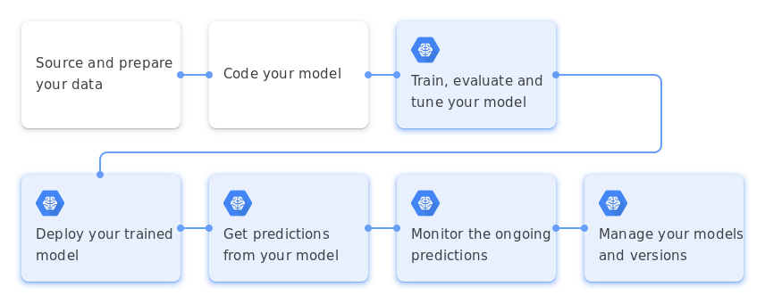

# Machine Learning: An Overview

Pada notebook ini, kita akan meninjau ulang dasar *machine learning*. Secara garis besar, topik yang akan kita bahas adalah:
* Apa itu *machine learning*
* Jenis *machine learning*
* *Machine learning workflow*


## Apa Itu *Machine Learning*

Pertama, coba isi mentimeter berikut. Menurut kamu, kira-kira apa yang dimaksud dengan machine learning?

```{image} assets/images/menti-ml.png
:width: 50%
:align: center
```

Untuk mendefinisikan *machine learning*, terlebih dahulu kita perlu tahu apa yang dimaksud dengan *learning* di sini.

Learning {cite:p}`Mitchell97`
: Sebuah program komputer dikatakan **belajar** dari **pengalaman _E_** dengan suatu **tugas _T_** dan sebuah **metrik _P_**, jika dan hanya jika, performa program komputer tersebut untuk **tugas _T_**, yang diukur oleh **metrik _P_**, semakin baik dengan **pengalaman _E_**.

Task *T*
: Tugas yang dimaksud di sini **bukanlah** proses belajar dari program tersebut. Tugas yang dimaksud di sini adalah **klasifikasi**, **regresi**, **_machine translation_** dan lainnya.

Performance *P*
: Sebuah metrik yang mengukur kemampuan program dalam menjalankan suatu tugas *T* dan biasanya hanya untuk tugas *T* saja. Contohnya, **akurasi**.

Experience *E*
: Proses belajar dari program yang secara umum dibedakan menjadi *supervised* dan *unsupervised* sesuai dengan dataset yang tersedia.


## Jenis *Machine Learning*

Secara umum, terdapat 2 jenis *machine learning* berdasarkan cara belajar suatu program: **supervised** dan **unsupervised**.

```{panels}
Supervised Machine Learning
^^^
Type of machine learning where the data have a target variable or the ground truth. *Task* dalam *supervised learning* terbagi menjadi 2 jenis: **regresi** dan **klasifikasi**
---
Unsupervised Machine Learning
^^^
Type of machine learning where the data doesn't have a target variable. Beberapa contoh *task* pada *unsupervised learning* seperti *clustering*, *dimensionality reduction*, *anomaly detection*, dan lainnya.
```


## *Machine Learning Workflow*

Untuk dapat melatih sebuah model *machine learning*, kita perlu melakukan beberapa persiapan.

```{epigraph}
Good data is {cite:p}`datacentric`:
* Defined consistently (definition of labels is unambiguous)
* Cover important cases (good coverage of inputs x)
* Has timely feedback from production data (covers distribution drift and concept drift)
* Sized appropriately
```

Secara umum, alur kerja *machine learning* adalah sebagai berikut {cite:p}`mlworkflow`.

<!--  -->

```{figure} ./assets/images/ml-workflow-google.png
:name: ml-workflow-google

Alur kerja *machine learning*.
```

Dari gambar di atas, langkah pertama adalah *source and prepare your data*. Langkah ini terdiri dari beberapa hal:
* Ambil data yang dibutuhkan
* Prapemrosesan data dan **_data understanding_**
    * penanganan *missing value*
    * _feature extraction_
    * _feature engineering_
    * dan lainnya
* Pembagian data menjadi training, development, dan test set

Kita perhatikan juga bahwa tidak ada *definition of done* pada alur kerja di atas. Hal ini karena kita akan terus memonitor performa model di production dan akan selalu melakukan pembaharuan pada model ataupun dataset dengan *versioning* keduanya.